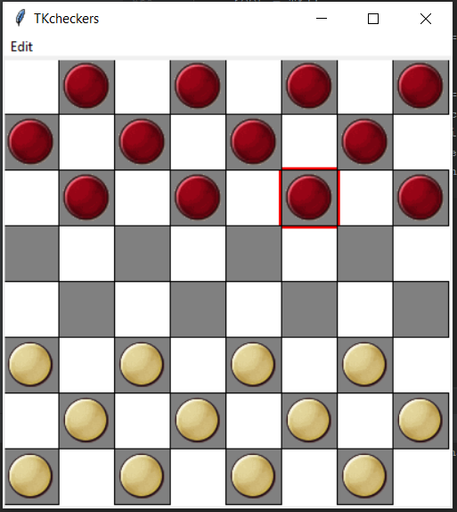

# TKCheckers
Игра «Шашки» написанная на Python3 при помощи библиотекой Tkinter.

### Идея
- Реализовать игру Шашки
- Добавить несколько режимов игры: Русские, Пул, Самоеды
- Добавить режим Игрок vs Игрок
- Добавить режим Игрок vs Компьютер 

### Цели
- Знакомство с Python3
- Работа с GUI
- Работа с tkinter
- Написание тестов, покрытие >80%
- Работа с принципами ООП

### Изображение

### Зависимости
- Необходим интерпретатор Python версии не ниже, чем 3.6
- Tkinter

### Автор
Ремша Игорь, 2019
